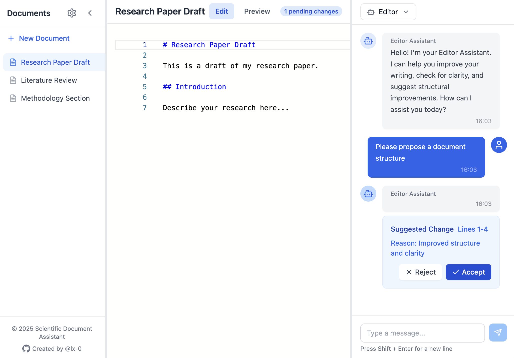

# Scientific Document Assistant 📚✨

<div align="center">



[](https://www.typescriptlang.org/)
[](https://reactjs.org/)
[](https://openai.com/)
[](LICENSE)

> Transform your scientific writing with AI-powered assistance, real-time collaboration, and intelligent document editing.

[Demo](https://sda.0fo.de) · [Documentation](#) · [Report Bug](#) · [Request Feature](#)

</div>

## ✨ Features

- 🤖 **AI-Powered Writing Assistance** - Multiple specialized AI agents for editing, reviewing, and research
- 📝 **Smart Document Editor** - Real-time markdown editing with instant AI feedback
- 💡 **Intelligent Suggestions** - Context-aware change proposals with line-by-line improvements
- 🔄 **Version Control** - Track changes and document history
- 👥 **Multiple AI Agents**:
    - Editor - Improves clarity and structure
    - Reviewer - Provides peer review feedback
    - Researcher - Assists with citations and research
    - BIDARA - Bio-Inspired Design and Research Assistant

## 🚀 Quick Start

```bash
# Clone the repository
git clone https://github.com/lx-0/scientific-document-assistant.git

# Install dependencies
cd scientific-document-assistant
npm install

# Set up environment variables
cp .env.example .env.development
cp .env.example .env.production

# Edit environment files and add your OpenAI API key
# For development:
vim .env.development
# For production:
vim .env.production

# Start development server
npm run dev
```

Visit `http://localhost:5173` to start using the application.

## 🐳 Docker Setup

### Development

```bash
# Start development environment
docker compose -f docker-compose.dev.yml up

# Rebuild development environment
docker compose -f docker-compose.dev.yml up --build
```

### Production

```bash
# Start production environment
docker compose -f docker-compose.prod.yml up -d

# Rebuild production environment
docker compose -f docker-compose.prod.yml up -d --build
```

## 🎯 Usage Example

1. **Create a New Document**

   ```markdown
   # Introduction
   This research explores the impact of...
   ```

2. **Get AI Assistance**

   ```markdown
   Editor: "I suggest improving the introduction's clarity..."

   <CHANGE-PROPOSAL reason="Enhanced academic tone">
     <ORIGINAL line="2">This research explores the impact of...</ORIGINAL>
     <PROPOSED>This study investigates the implications of...</PROPOSED>
   </CHANGE-PROPOSAL>
   ```

3. **Accept or Reject Changes**
   - Review suggested changes
   - Apply improvements with one click
   - Continue the conversation for further refinement

## 🛠️ Tech Stack

- **Frontend**: React, TypeScript, Tailwind CSS
- **State Management**: Zustand
- **UI Components**: Radix UI
- **AI Integration**: OpenAI GPT-4
- **Editor**: Monaco Editor
- **Styling**: Tailwind CSS

## 🔧 Configuration

### Environment Variables

The project uses different environment files for development and production. Copy `.env.example` to create your environment files:

```bash
# Create environment files
cp .env.example .env.development
cp .env.example .env.production

# Edit files and add your OpenAI API key
vim .env.development
vim .env.production
```

Required variables:

```env
# OpenAI API Configuration
VITE_OPENAI_API_KEY=your_openai_api_key_here

# Server Configuration
PORT=5173  # Default port (can be changed)

# Feature Flags
VITE_ENABLE_DEBUG=false  # Set to true for development
```

#### Development vs Production

- Development (`.env.development`):
    - Default `PORT=5173`
    - `VITE_ENABLE_DEBUG=true`

- Production (`.env.production`):
    - Default `PORT=80`
    - `VITE_ENABLE_DEBUG=false`

You can override the port when running Docker:

```bash
# Run development with custom port
PORT=3000 docker compose -f docker-compose.dev.yml up

# Run production with custom port
PORT=8080 docker compose -f docker-compose.prod.yml up -d
```

### Agent Configuration

```typescript
{
  name: "Editor",
  description: "Helps improve writing clarity and structure",
  capabilities: {
    webSearch: false,
    codeExecution: false,
    fileAccess: true
  }
}
```

## 📚 Documentation

### Available Agents

| Agent | Purpose | Capabilities |
|-------|---------|--------------|
| Editor | Writing improvement | Style, clarity, structure |
| Reviewer | Peer review | Academic evaluation |
| Researcher | Citation assistance | Literature search |
| BIDARA | Bio-inspired design | Biomimicry research |

### Key Components

- `ConversationManager` - Handles AI communication
- `DocumentEditor` - Manages document editing
- `AgentSystem` - Controls AI agent behavior

## 🗺️ Roadmap

- [ ] Backend implementation for improved security
- [ ] Collaborative editing features
- [ ] Enhanced document version control
- [ ] Web search capability
- [ ] Citation management system
- [ ] Export to various formats

## 🤝 Contributing

1. Fork the repository
2. Create your feature branch (`git checkout -b feature/AmazingFeature`)
3. Commit your changes (`git commit -m 'Add some AmazingFeature'`)
4. Push to the branch (`git push origin feature/AmazingFeature`)
5. Open a Pull Request

## 📄 License

This project is licensed under the MIT License - see the [LICENSE](LICENSE) file for details.

## 🙏 Acknowledgments

- OpenAI for GPT-4 API
- React and TypeScript communities
- All contributors and users

---

<div align="center">

**[⬆ Back to Top](#scientific-document-assistant-)**

Made with ❤️ by [Your Name/Organization]

</div>
